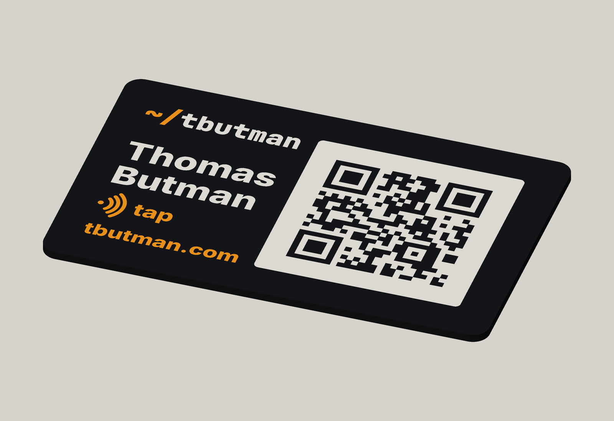
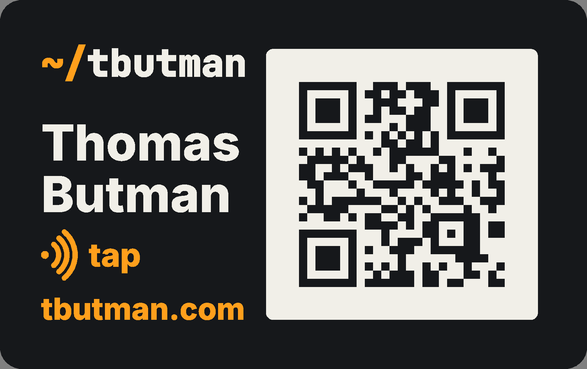
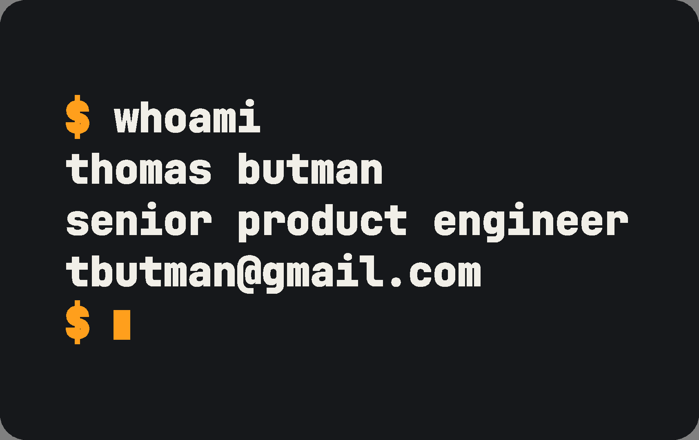

# Business card

A 3D-printed business card with a QR code and an NFC tag, both opening
[tbutman.com/hello](https://tbutman.com/hello). Modelled in OpenSCAD, printed in three colours of
PLA, with the tag sealed inside during a pause.



| Front | Back |
| --- | --- |
|  |  |

- **Size:** ID-1 (85.60 × 53.98 mm, 3.2 mm corners), 1.6 mm thick.
- **QR code:** version 2-M, 25 × 25 modules of 1.2 mm, black modules on a white field that
  includes the full 4-module quiet zone. The white is a 0.6 mm inlay, flush with the top.
- **NFC:** a 25 mm NTAG215 sticker in a 25.3 mm pocket behind the name, under 4 solid layers. An
  amber "tap" marker (generic NFC waves, not the EMVCo payment symbol) sits over it.
- **Back:** a terminal session (`$ whoami`, name, role, email, cursor) inlaid 0.6 mm into the
  side that prints against the plate, mirrored so it reads correctly when the card is turned over.
  The email is one parameter, `back_email`.
- **Type:** Inter ExtraBold and JetBrains Mono ExtraBold, the site's own typefaces. Cap heights
  are 3.2 mm or more, and every stroke is at least 0.5 mm on both faces.

How to print it, including the NFC pause layer and writing the tag: [PRINTING.md](PRINTING.md).

## Files

| Path | What |
| --- | --- |
| `card.scad` | The parametric model. Every dimension and string is a named parameter at the top. |
| `qr_matrix.scad` | The QR module matrix, generated by `scripts/gen_qr.py` (never hand-edited). |
| `out/card-{body,light,accent}.stl` | One STL per colour: black, white, orange. |
| `out/card-top-surface.png`, `out/card-back-surface.png` | Each face as printed, rasterised from the STLs (the back as seen from behind); the QR check decodes the front. |
| `preview.png` | A 3/4 render of the three STLs. |
| `fonts/` | Static instances of the site's variable fonts (SIL Open Font License; see the licence files). |
| `scripts/` | QR generation, verification and preview rendering. |

## Build

Needs Docker (OpenSCAD runs in the official `openscad/openscad:dev` image, so nothing needs
installing) and Python 3:

```bash
python3 -m venv .venv && .venv/bin/pip install -r requirements.txt
./build.sh
```

`build.sh` regenerates the QR matrix from `qr_url`, exports the three STLs, runs the checks below
and re-renders the preview. To edit the model interactively, open `card.scad` in any recent
OpenSCAD and switch `part` in the Customizer.

`card.scad` refuses to render if `qr_url` no longer matches `qr_matrix.scad`, if a module is
under 1 mm, if the inlay is under 0.4 mm, if text is under 3 mm, or if the NFC pocket has fewer
than two layers over it or sits under the QR field.

## Checks

`scripts/verify.py` checks the exported STLs, not the source:

- every colour body is manifold (each edge shared by exactly two triangles);
- the front, rasterised from the STLs in print colours, decodes with OpenCV to exactly
  `https://tbutman.com/hello`: at 20 px/mm, at 4 px/mm, and with a heavy blur;
- on both faces, opening each text mask with a 0.5 mm disk loses nothing larger than a
  glyph-corner sliver (0.06 mm²). In other words, no stroke is thinner than 0.5 mm.

Result on the current files: all pass. These checks are on the digital model. A printed card has
not been scanned or tapped yet; see the print log.

## Design notes

- The QR modules are the black body showing through the white field, so the code has no
  separate dark part. Dark modules are grown by 0.02 mm (`qr_overlap`), so diagonal neighbours
  overlap instead of meeting at a zero-width edge. That edge would make both STLs non-manifold.
- `JetBrains Mono` set the domain at first, but its narrow `m` has stems under 0.5 mm at this
  size. Inter's `m` is wider. The mono face stays for the `~/tbutman` mark, which matches the
  site header: amber `~/`, light `tbutman`. It is set as one string and split by colour, so the
  spacing is the font's own. At 4 mm its `m` passes, but the mono `a` has a thin joint between
  bowl and stem, so the mark's outline grows by 0.05 mm (`mark_bolden`). The back's mono text
  grows by 0.05 mm too, and its `$` prompts by 0.15 mm, because the font draws the `$` bar as a
  hairline.
- The amber rule under the name became the tap marker: the rule floated in an empty gap, and
  most people don't expect a printed card to be tappable.
- In OpenSCAD 2026.09, `text(size = s)` gives a cap height of about `s` mm for both fonts
  (measured: an `H` at size 10 is 10.1 mm), so the sizes above are cap heights.

## Counting scans

The site promises 0 cookies and 0 trackers, so there are no analytics. Count visits from nginx's
own access log instead. The nginx container logs to stdout, so on the server, in the site's
Docker Compose directory:

```bash
sudo docker compose logs --no-log-prefix website | grep -c '"GET /hello'
```

This counts requests, not people. The QR code and the NFC tag open the same URL, so they can't be
told apart. Link-preview bots and reloads count too. The log only goes back to when the
container was last recreated (for example, by an nginx image update).

## Print log

| Date | Cards | Result |
| --- | --- | --- |
| | | Not printed yet |
