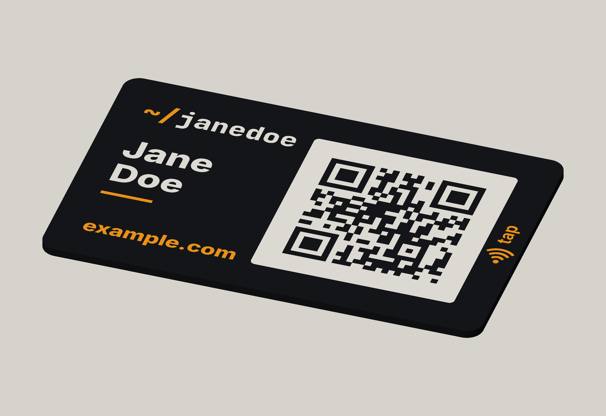
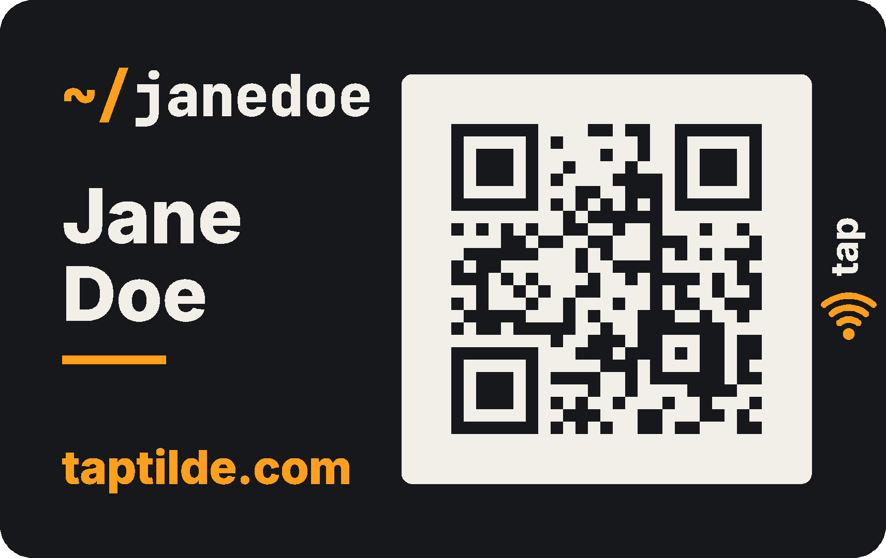
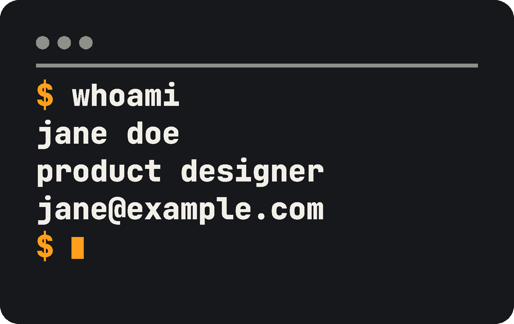

# Tilde card

A business card you print yourself, made to go with [Tilde](https://taptilde.com), the
Android app that turns your phone into an NFC business card. The front has a QR code that opens your
website. Add an NFC sticker, sealed inside during the print, and people can tap it with their phone
too.

**Free and open source.** The model is free to download, print and change: MIT for the source,
CC BY 4.0 on MakerWorld. No account, sign-up, subscription or payment, and no service in between:
the card links straight to your own website. It works without the app too: phones read it on their
own, and any NFC app can write the sticker. More about Tilde and the card:
[taptilde.com](https://taptilde.com).

| Front | Back |
| --- | --- |
|  |  |

- **Credit-card size** (85.6 × 54 mm), 1.6 mm thick (1.8 mm with an NFC sticker, 2.0 mm with a thick one), so it fits
  a wallet.
- **A QR code that works with any phone camera.** It's the heart of the card.
- **NFC is optional.** If you add it, the printer pauses halfway, you drop in a sticker, and the
  rest of the card prints over it, sealing it inside; iPhones and Android phones with NFC then open
  your link when tapped against the marked spot. Without one, it's a QR card: no stickers and no
  pause.
- **Three backs to choose from:** a terminal window (`$ whoami`, as above), a plain one, or none,
  which prints fastest. Both designs print three lines you choose, such as your name, title and
  email.
- **Four colors of PLA**, printed all at once on a printer with an AMS (or another multi-color
  system). No painting or gluing.

The files in `out/` are a sample card for Jane Doe, an example person, linking to taptilde.com. To
make yours, type in your name, links and colors on MakerWorld (coming soon) or in OpenSCAD's
Customizer: see [Make it yours](PRINTING.md#make-it-yours). The Customizer starts on the 0.4 mm
nozzle, the faster print and the one most printers come with; see
[Choose a nozzle](PRINTING.md#choose-a-nozzle).

## Print one

[PRINTING.md](PRINTING.md) walks through it step by step: which nozzle to use, the slicer settings
and, if you add NFC, which stickers to buy, the pause for the sticker and how to put your link on
it.

## Tilde, the app it goes with

[Tilde](https://github.com/tbutman/tilde) is a free, open-source Android app (MIT, no account, no ads,
no internet permission) that does what the card does, from your phone: people tap your phone, or scan the code on its screen, to get your website,
contact card, WhatsApp or LinkedIn. It also writes your link onto the card's NFC sticker
(**Settings → Write a sticker**). Get it at [taptilde.com](https://taptilde.com).

## For developers

The model is written in [OpenSCAD](https://openscad.org): `card.scad` holds every size and every
line of text as a setting. [docs/DESIGN.md](docs/DESIGN.md) covers how it's built and checked,
the design decisions, and the print log.

## License

The model and scripts are [MIT](LICENSE) © Thomas Butman. The printable files on MakerWorld are
shared under [CC BY 4.0](https://creativecommons.org/licenses/by/4.0/): print, remix and sell
cards freely, with credit. The fonts in `fonts/` are Inter and JetBrains Mono, under the SIL Open
Font License (see the license files beside them).
